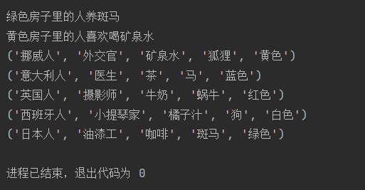
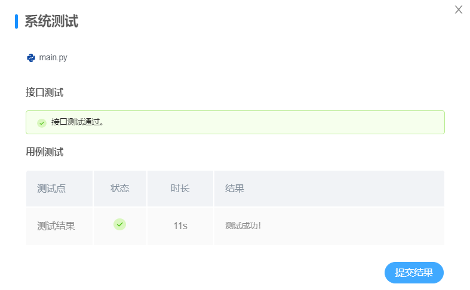

# <center>**程序报告**</center>
### <center>学号：2112492&emsp;&emsp;&emsp;&emsp;&emsp;&emsp;姓名：刘修铭</center>

&nbsp;
## **一、问题重述**
>**斑马问题**： 5 个不同国家（英国、西班牙、日本、意大利、挪威）且工作各不相同（油漆工、摄影师、外交官、小提琴家、医生）的人分别住在一条街上的 5 所房子里，  每所房子的颜色不同（红色、白色、蓝色、黄色、绿色），每个人都有自己养的不同宠物（狗、蜗牛、斑马、马、狐狸），喜欢喝不同的饮料（矿泉水、牛奶、茶、橘子汁、咖啡）。  
>根据以下提示，你能告诉我哪所房子里的人养斑马，哪所房子里的人喜欢喝矿泉水吗？
>&nbsp;
>
>### 对问题的理解     
>* 问题中共有5个房子，每个房子有5种类型的数据。        
>每个房子相当于一个逻辑变量，而这一个逻辑变量中还包含5个分别代表 国家、工作、饮料、宠物、颜色 的逻辑变量。         
>&nbsp;
* 而问题的要求则是根据给出的、关于这五组变量之间的部分逻辑关系，进行逻辑推理，最后得出所有的未知数据。
&nbsp;
* 问题可以抽象为一个5*5的数组，已知这个数组每行的部分元素值和行之间的位置关系，逻辑推算出该数组的全部元素。

## **二、设计思想**
* 首先自定义之后会用到的函数：
  left、right、和next函数            
  * 构建方法核心：           
   &emsp;&emsp;将房子列表错位zip，使得每个房子都和它旁边的房子对应打包为元组，然后返回由这些元组组成的列表。此时元组中左右元素即为相邻房子的左右顺序，使用kanren中的membero，即包含逻辑关系，赋予参数x、y左右的位置关系。
  ```Python
  def left(x,y,units):
      groups=zip(units,units[1:])
      # units为原来的房子序列，通过切片units[1:]使其错位一个房子，然后用zip打包。
      return membero((x,y),groups)
  
  def right(x,y,units):
      return left(y,x,units)
  
  def next(x,y,units):
      return conde([left(x, y, units)], [right(x, y, units)])
  ```

* 构建智能体类对象 agent ，类中定义逻辑变量units       
  ```python
  self.units = var()
  (eq, (var(), var(), var(), var(), var()), self.units)
  # 相当于 self.units =（var，var，var，var，var）
  ```
  &emsp;&emsp;units中包含5个房子的逻辑变量，而每个房子的逻辑变量var又包括5个逻辑变量 (国家，工作，饮料，宠物，颜色)          
  &emsp;&emsp;agent中还定义了rules_zebraproblem 和 solutions，分别用来定义规则和存储结果。

* 智能体类中定义规则函数：        
  * 使用kanren包中的lall函数定义规则
    * membero表示 包含关系 ,下例表明 红色的、住着英国人的房子var 包含在units里。
     ```python
     (membero, ('英国人',var(),var(),var(),'红色'),self.units)
     ```
    * eq表示 相等关系 ，下例表明 挪威人住在左边的第一个房子里 
    ```python
    (eq, (('挪威人', var(), var(), var(), var()) ,var(),var(),var(),var()), self.units),
    ```
    * next 和 left、right 的含义已在上文介绍   
    &nbsp;


  完整代码        
  ```python
  self.rules_zebraproblem = lall(
            (eq, (var(), var(), var(), var(), var()), self.units),

            (membero, (var(), var(), var(), '斑马', var()), self.units),
            (membero, (var(), var(), '矿泉水', var(), var()), self.units),
            (membero, ('英国人',var(),var(),var(),'红色'),self.units),
            (membero, ('西班牙人', var(), var(), '狗', var()), self.units),
            (membero, ('日本人', '油漆工', var(), var(), var()), self.units),
            (membero, ('意大利人', var(), '茶', var(), var()), self.units),
            (eq, (('挪威人', var(), var(), var(), var()) ,var(),var(),var(),var()), self.units),
            (right, (var(), var(), var(), var(), '绿色'), (var(), var(), var(), var(), '白色'), self.units),
            (membero, (var(), '摄影师', var(), '蜗牛', var()), self.units),
            (membero, (var(), '外交官', var(), var(), '黄色'), self.units),
            (eq, ( var(),var(), (var(), var(), '牛奶', var(), var()), var(),var() ),self.units),
            (membero, (var(), var(), '咖啡', var(), '绿色'), self.units),
            (next, ('挪威人', var(), var(), var(), var()), (var(), var(), var(), var(), '蓝色'), self.units),
            (membero, (var(), '小提琴家', '橘子汁', var(), var()), self.units),
            (next, (var(), var(), var(), '狐狸', var()),(var(), '医生', var(), var(), var()),self.units),
            (next, (var(), var(), var(), '马', var()), (var(), '外交官', var(), var(), var()), self.units)
        )
  ```
* 规则求解，利用之前定义的逻辑关系，调用run函数得到问题解                     
  ```python
      def solve(self):
        """
        规则求解器(请勿修改此函数).
        return: 斑马规则求解器给出的答案，共包含五条匹配信息，解唯一.
        """
  
        self.define_rules()
        self.solutions = run(0, self.units, self.rules_zebraproblem)
        return self.solutions
  ```


&nbsp;
## **三、代码内容**
```Python
from kanren import run, eq, membero, var, conde  # kanren一个描述性Python逻辑编程系统
from kanren.core import lall  # lall包用于定义规则
import time


def left(x,y,units):
    groups=zip(units,units[1:])
    return membero((x,y),groups)

def right(x,y,units):
    return left(y,x,units)

def next(x,y,units):
    return conde([left(x, y, units)], [right(x, y, units)])


class Agent:
    """
    推理智能体.
    """

    def __init__(self):
        """
        智能体初始化.
        """

        self.units = var()  # 单个unit变量指代一座房子的信息(国家，工作，饮料，宠物，颜色)
        # 例如('英国人', '油漆工', '茶', '狗', '红色')即为正确格式，但不是本题答案
        # 请基于给定的逻辑提示求解五条正确的答案
        self.rules_zebraproblem = None  # 用lall包定义逻辑规则
        self.solutions = None  # 存储结果

    def define_rules(self):
        """
        定义逻辑规则.
        """

        self.rules_zebraproblem = lall(
            (eq, (var(), var(), var(), var(), var()), self.units),
            # self.units共包含五个unit成员，即每一个unit对应的var都指代一座房子(国家，工作，饮料，宠物，颜色)
            # 各个unit房子又包含五个成员属性: (国家，工作，饮料，宠物，颜色)
            

            # 示例：基于问题信息可以提炼出，有人养斑马，有人喜欢和矿泉水等信息
            (membero, (var(), var(), var(), '斑马', var()), self.units),
            (membero, (var(), var(), '矿泉水', var(), var()), self.units),
            (membero, ('英国人',var(),var(),var(),'红色'),self.units),
            (membero, ('西班牙人', var(), var(), '狗', var()), self.units),
            (membero, ('日本人', '油漆工', var(), var(), var()), self.units),
            (membero, ('意大利人', var(), '茶', var(), var()), self.units),
            (eq, (('挪威人', var(), var(), var(), var()) ,var(),var(),var(),var()), self.units),
            (right, (var(), var(), var(), var(), '绿色'), (var(), var(), var(), var(), '白色'), self.units),
            (membero, (var(), '摄影师', var(), '蜗牛', var()), self.units),
            (membero, (var(), '外交官', var(), var(), '黄色'), self.units),
            (eq, ( var(),var(), (var(), var(), '牛奶', var(), var()), var(),var() ),self.units),
            (membero, (var(), var(), '咖啡', var(), '绿色'), self.units),
            (next, ('挪威人', var(), var(), var(), var()), (var(), var(), var(), var(), '蓝色'), self.units),
            (membero, (var(), '小提琴家', '橘子汁', var(), var()), self.units),
            (next, (var(), var(), var(), '狐狸', var()),(var(), '医生', var(), var(), var()),self.units),
            (next, (var(), var(), var(), '马', var()), (var(), '外交官', var(), var(), var()), self.units)
        )


    def solve(self):
        """
        规则求解器(请勿修改此函数).
        return: 斑马规则求解器给出的答案，共包含五条匹配信息，解唯一.
        """

        self.define_rules()
        self.solutions = run(0, self.units, self.rules_zebraproblem)
        return self.solutions


agent = Agent()
solutions = agent.solve()

# 提取解释器的输出
output = [house for house in solutions[0] if '斑马' in house][0][4]
print ('\n{}房子里的人养斑马'.format(output))
output = [house for house in solutions[0] if '矿泉水' in house][0][4]
print ('{}房子里的人喜欢喝矿泉水'.format(output))

# 解释器的输出结果展示
for i in solutions[0]:
    print(i)
```

&nbsp;
## **四、实验结果**
* 输出结果如下：
&nbsp;  
<div align=center>
  
</div>

&nbsp;      
* 平台检测结果：
&nbsp; 
<div align=center>
  
</div>             

&nbsp;
## **五、总结**
* 实验运用 kanren 的逻辑包进行逻辑推理，最终得到结果。
* 问题关键在于理解 kanren 包的使用规则
* 难点在于理解利用 切片和zip 构造 left、right、next 位置关系。
