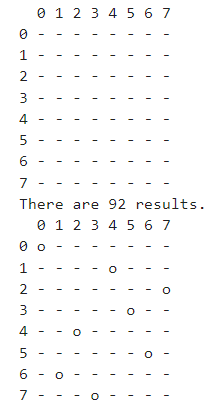
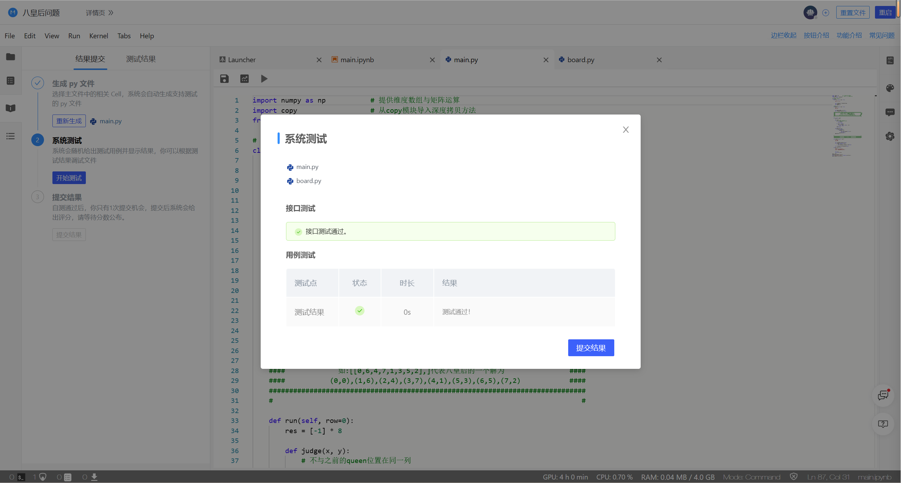

# <center>**程序报告**</center>
### <center>学号：2112492&emsp;&emsp;&emsp;&emsp;&emsp;&emsp;姓名：刘修铭</center>

&nbsp;
## **一、问题重述**
>**八皇后问题**： 如何能在 8*8 的国际象棋棋盘上放置八个皇后，使得任何一个皇后都无法直接吃掉其他的皇后？为了到达此目的，任两个皇后都不能处于同一条横行、纵行或斜线上。
&nbsp;
### **对问题的理解**       
* 将问题抽象成数学模型，即从一个 8*8 的矩阵中选8个位置，使得这8个位置中的任何两个位置都不在同一列、同一行或同一条斜线。         
&nbsp; 
  * 不在同一行：这8行中的每一行必须有且只有一个点。        
  * 不在同一列：这8个点所在的列数必须是 1-8 中的一个数，且不可重复。           
  * 不在同一条斜线：任意两个点的横纵坐标之差的绝对值不相等。       
&nbsp;   
## **二、设计思想**
 ### **已知条件：**             
  * 题目中已经提供了一个 board.py ，里面实现了一个Chessboard类，用以进行对棋盘的操作。                  
  * 题目还提供了 Game 类的部分函数的实现，最后要做到的是通过实例化一个Game类对象，让该对象调用get_results()函数，得到所有的问题解。           
  * 通过分析Game类发现，完成程序完成的关键是补全Game类中的run函数，设计算法找到所有的落子情况。每种落子情况用一个形如 [0,6,4,7,1,3,5,2] 的列表表示，最后得到的是包含了所有情况list的大列表。
 ### **实现思想：**               
 &emsp;&emsp; 使用递归方法实现回溯思想来解决此问题：
  * **回溯法思想：**
    1. 先把第一个棋子放到第一行第一列；      
    2. 把第二个棋子从第二行第一个位置开始往右遍历，依次判断位置是否合适（判断该位置和前几行已确定好的棋子位置是否满足那三个限制条件），直到找到第一个合适的位置，进入下一行的位置判断；            
    3. 依次进行第三行及后面行的位置寻找；
    4. * 当这种寻找过程成功进行到第8行时，说明这组落子满足条件，记录这种成功情况。再回溯上一行，改变落子位置再继续寻找。
       * 若寻找过程进行到第i行时，所有位置都不满足条件，不必再往下遍历，直接回溯上一行，改变落子位置继续试探。
    5. 直到回溯到第一行的所有位置都被试探完毕时，则可找到所有的成功情况。

  * **递归实现：**
    1. 首先定义递归函数game_play (row) ，为了寻找在行数为row时的遍历情况；
    2. 在递归函数里依次对列进行遍历，判断是否满足条件，若满足条件：
       * 若此时正好是第8行（即 row = 7 ）：保存答案，函数返回
       * 若是其他行：寻找下一行的落子点，即递归调用game_play (row + 1) 
    * 这样就可以实现把第一行的各种遍历情况压在栈最低，第二行次之，第三行再次之......，先处理栈顶，也就是最后一行的各种位置，再逐渐往前面的行找，满足回溯法思想。
  
  * **判断位置是否满足落子条件：**
    &emsp;&emsp; 
    1. 不在同一行：list列表 [  ] 共有8个数；     
    2. 不在同一列：要判断的位置所在的列不能在list中出现过；            
    3. 不在同一条斜线：要判断的位置与之前所有已确定位置的横纵坐标之差的绝对值不相等。   
       
 ### **run函数代码**  
  ```Python
  def run(self, row=0):
      res = [-1] * 8

      def judge(x, y):
          # 不与之前的queen位置在同一列
          if y in res[0:x]:
              return False

          # 不与之前的queen位置在同一条斜线
          for rows in range(x):
              cols = res[rows]
              if abs(x - rows) == abs(y - cols):
                  return False
          res[x] = y
          return True

      def game_play(row=0):
          for col in range(8):
              if judge(row, col):
                  if row == 7:
                      self.solves.append(list(res))
                      return None
                  game_play(row + 1)
      
      game_play(0)
  ```

&nbsp;
## **三、代码内容**
```Python
import numpy as np           # 提供维度数组与矩阵运算
import copy                  # 从copy模块导入深度拷贝方法
from board import Chessboard

# 基于棋盘类，设计搜索策略
class Game:
    def __init__(self, show = True):
        """
        初始化游戏状态.
        """
        
        self.chessBoard = Chessboard(show)
        self.solves = []
        self.gameInit()
        
    # 重置游戏
    def gameInit(self, show = True):
        """
        重置棋盘.
        """
        
        self.Queen_setRow = [-1] * 8
        self.chessBoard.boardInit(False)
        
    ##############################################################################
    ####                请在以下区域中作答(可自由添加自定义函数)                 #### 
    ####              输出：self.solves = 八皇后所有序列解的list                ####
    ####             如:[[0,6,4,7,1,3,5,2],]代表八皇后的一个解为                ####
    ####           (0,0),(1,6),(2,4),(3,7),(4,1),(5,3),(6,5),(7,2)            ####
    ##############################################################################
    #                                                                            #
    
    def run(self, row=0):
        res = [-1] * 8

        def judge(x, y):
            # 不与之前的queen位置在同一列
            if y in res[0:x]:
                return False

            for rows in range(x):
                cols = res[rows]
                if abs(x - rows) == abs(y - cols):
                    return False
            res[x] = y
            return True

        def game_play(row=0):
            for col in range(8):
                if judge(row, col):
                    if (row == 7):
                        self.solves.append(list(res))
                        return None
                    game_play(row + 1)
        game_play(0)


    #                                                                            #
    ##############################################################################
    #################             完成后请记得提交作业             ################# 
    ##############################################################################
    
    def showResults(self, result):
        """
        结果展示.
        """
        
        self.chessBoard.boardInit(False)
        for i,item in enumerate(result):
            if item >= 0:
                self.chessBoard.setQueen(i,item,False)
        
        self.chessBoard.printChessboard(False)
    
    def get_results(self):
        """
        输出结果(请勿修改此函数).
        return: 八皇后的序列解的list.
        """
        
        self.run()
        return self.solves

game = Game()
solutions = game.get_results()
print('There are {} results.'.format(len(solutions)))
game.showResults(solutions[0])

```

&nbsp;
## **四、实验结果**
* 输出结果如下：
&nbsp;            
      
&nbsp;      
* 平台检测结果：
&nbsp;             
               

&nbsp;
## **五、总结**
* 实验利用了回溯法解决了八皇后问题，达到了预期目标；
* 通过实验熟悉了递归的思想；
* 模型评价：本模型相当于对每种情况都进行了遍历，思路清晰但遍历的开销不小；并且，本实验的实现利用了递归，递归调用函数也会造成较大的开销；
* 改进方向：考虑使用非递归算法；并且减少不必要的遍历，比如在确定一个位置之后，就不再考虑遍历由这个位置所限制的其他位置。