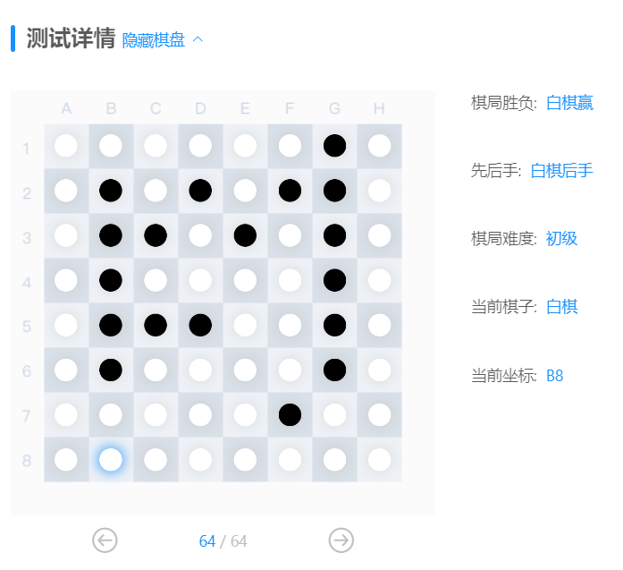
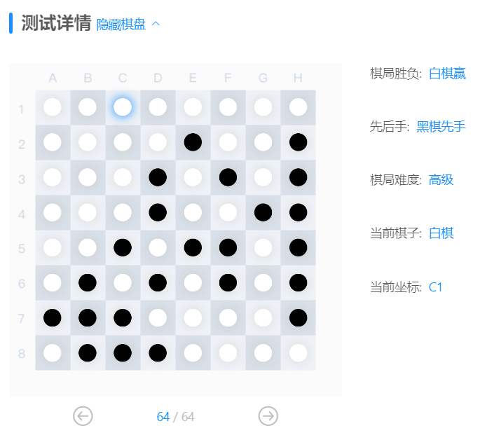

# <center>**程序报告**</center>
### <center>学号：2112492&emsp;&emsp;&emsp;&emsp;&emsp;&emsp;姓名：刘修铭</center>

&nbsp;
## **一、问题重述**
>**黑白棋问题**： 黑白棋 (Reversi)，也叫苹果棋，翻转棋，是一个经典的策略性游戏。       
一般棋子双面为黑白两色，故称“黑白棋”。因为行棋之时将对方棋子翻转，则变为己方棋子，故又称“翻转棋” (Reversi) 。
棋子双面为红、绿色的称为“苹果棋”。它使用 8x8 的棋盘，由两人执黑子和白子轮流下棋，最后子多方为胜方。    
&nbsp;  
**实验要求**：使用 『蒙特卡洛树搜索算法』 实现 miniAlphaGo for Reversi。
&nbsp;
### 对问题的理解     
* 实验平台上已经给出了棋盘类 Board 、游戏类 Game 的方法接口，我们要实现的是利用这些接口写一棵蒙特卡洛搜索树，实现 AIplayer 智能体对棋局最优下一步的求解。         

## **二、设计思想**
### **2.1 『蒙特卡洛搜索树』算法流程**
*   **选择**
&emsp;&emsp;从根节点开始，根据UCB的大小选择一个UCB最大的子结点，直到到达叶子节点或具有还未被扩展的子节点。
*   **扩展**
&emsp;&emsp;若选择的节点不是终止节点，则随机扩展它的一个为扩展过的后继节点。
*   **模拟**
&emsp;&emsp;从上一环节要被扩展的节点出发，模拟扩展搜索树。在本实验中，采用随机模拟的方法，即从该节点出发，随机走子，直到走子结束。
*   **反向传播**
&emsp;&emsp;根据上一环节的模拟结果回溯更新模拟路径上的奖励均值和被访问次数。

### **2.2  设计算法与数据结构**

* ### **2.2.1 节点类**
在智能体类中定义一个节点类 Node，用于表示蒙特卡洛树的每个节点。在节点类中，实现了以下属性和函数（属性以及函数的意义见注释）：
```
节点类属性
self.color = color              # 节点执子方
self.visit_times = 0            # 节点被访问次数
self.board_state = board_state  # 当前状态下的棋盘
self.black_times = 0            # 该节点（及其子结点的棋盘上）黑棋的个数之和
self.white_times = 0            # 该节点（及其子结点的棋盘上）白棋的个数之和
self.parent = parent            # 父节点
self.children = []              # 子节点（已被扩展的点）
self.action = action
```

```
节点类函数
def is_all_expand(self)     # 用于判断节点是否被完全扩展
```

*  ### **2.2.2 智能体类**
为实验平台所给的智能体类添加函数：

### **预先设置：判断搜索树是否可以继续扩展**
```
def is_terminal(self, board_state) # 搜索树是否到底
```
当黑白棋两方都不能再继续走子，说明搜索树不能再扩展了。      
&nbsp;
### **过程1. 选择**              
```
def selection(self, node)
```
从node节点开始向下选择，分为以下几种情况：             
&emsp;&emsp;（1）节点所在棋局没有可以走子的点了（节点为终局节点），选择结束，直接进入反向传播，根据该结局来向上更新；          
&emsp;&emsp;（2）节点还未完全扩展，则需要扩展该点，执行 expansion 扩展函数；          
&emsp;&emsp;（3）节点已经完全扩展，继续选择这个它的子节点里ucb最大的点，执行 best_ucb 函数；    
&nbsp;
```
def best_ucb(self, node, ratio=1)
```
在选择过程中，需要依据节点的ucb大小，该函数实现了计算 node 节点最大ucb子节点的功能：             
由于黑白棋最后的输赢结果取决于双方棋子的数量，所以在设计ucb的时候，用节点的 black_times 和 white_times 计算奖励均值。ucb的初始系数 ratio 定义为1。
&nbsp;
### **过程2. 扩展** 
```
def expansion(self, node)
```
扩展函数实现对未完全扩展 / 叶节点的扩展。    
扩展函数对 node 讨论以下情况：        
（1）node 对应的棋局没有可以走子的位置了：返回node的父节点
（2）node 还有未扩展过的走子位置（即还存在可走子位置没被放进children里）：      
随机选择一个未扩展过的子节点，并把该子节点的扩展结果放进 node 的  children 里。返回新扩展的子节点。
&nbsp;
### **过程3. 模拟** 
```
def stimulation(self, node)
```
模拟函数实现对 node 的快速随机走子模拟。    
由于胜负有时间限制，所以控制走子步数在30以内，在模拟走子的时候，来回翻转颜色，使得双方随机选择可以走子的位置，最后返回终局（或30步之后的棋局下）黑棋和白棋的个数。
&nbsp;
### **过程4. 反向传播** 
```
def back_propagation(self, node, black, white)
```
从当前节点（被模拟的节点）开始反向传播，更新他们的父节点。
&nbsp;
### **搜索核心框架** 
```
def MCTS_search(self, point, maxtimes=100)
```
maxtime限制了搜索时间，规定在100次的范围内搜索完成，防止过度搜索。    

&emsp;&emsp;在每次搜索过程中，依次执行选择、扩展、模拟、反向传播，直至达到最大搜索次数。（由于在 selection 函数中直接调用了 expansion 函数，所以在主框架中未显式出现expansion函数的调用 ）          
&emsp;&emsp;随着搜索次数的增加，搜索树的规模不断增大。在所有搜索都结束后，返回根节点的最好的子节点（根节点的 best_ucb ）作为本次决策的结果。


&nbsp;
## **三、代码内容（main.py）**
```Python
import copy
import math
import random
class AIPlayer:
    """
    AI 玩家
    """

    def __init__(self, color):
        """
        玩家初始化
        :param color: 下棋方，'X' - 黑棋，'O' - 白棋
        """

        self.color = color

    # 节点类（蒙特卡洛搜索树的节点）
    class Node:
        # 初始化
        def __init__(self, board_state, color, parent=None, action=None):
            self.color = color  # 节点执子方
            self.visit_times = 0  # 节点被访问次数
            self.reward = 0.0  # 当前评分
            self.board_state = board_state  # 当前状态下的棋盘
            self.black_times = 0
            self.white_times = 0
            self.parent = parent  # 父节点
            self.children = []  # 子节点
            self.action = action

        # 节点是否完全扩展
        def is_all_expand(self):
            # 当前棋盘下，color一方可以下棋的合法位置个数
            all_count = len(list(self.board_state.get_legal_actions(self.color)))
            # 已经扩展的节点个数
            children_count = len(self.children)
            if all_count <= children_count:
                return True
            else:
                return False

    # 判断是否还能够扩展树（搜索树是否到底）
    def is_terminal(self, board_state):
        blacks = list(board_state.get_legal_actions('X'))
        whites = list(board_state.get_legal_actions('O'))
        # 当黑棋和白棋都不能再走的时候，说明树已经到底了
        if len(blacks) == 0 and len(whites) == 0:
            return True
        return False

    def expansion(self, node):
        # 还可以走的位置
        a = list(node.board_state.get_legal_actions(node.color))
        # 已经扩展的位置
        b = [i.action for i in node.children]
        # 无路可走时，返回父节点
        if len(a) == 0:
            return node.parent
        # 还可以走的时候，随机找一个可以走的位置action，并保证找的这个action不在已经扩展的范围内
        action = random.choice(a)
        while action in b:
            action = random.choice(a)

        # 将扩展后的情况放到子结点中
        new_state = copy.deepcopy(node.board_state)
        new_state._move(action, node.color)  # 走完这步棋的棋盘状态
        new_color = 'X' if node.color == 'O' else 'O'  # 子节点棋的颜色

        # 为节点添加子节点
        child = self.Node(new_state, new_color, parent=node, action=action)
        node.children.append(child)

        return node.children[-1]

    # 直到达到一个不完全扩展节点（即此节点的仍有未访问的子节点）
    def selection(self, node):
        while not self.is_terminal(node.board_state):
            # 没有可以扩展的节点了，也就是说要模拟这个节点（返回这个节点，直接进入下下步模拟环节）
            if len(list(node.board_state.get_legal_actions(node.color))) == 0:
                return node

            # node还未完全扩展（也就是node的子节点个数<还可以走的位置数）即还有位置没被扩展
            elif not node.is_all_expand():
                # 扩展，即随机返回一个没有扩展的可扩展点，并将其存入children（已扩展的子节点）里面
                new_node = self.expansion(node)
                return new_node
            else:
                # node所有可以扩展的点都被扩展完了，就该选择这个节点的子节点里面ucb最大的点，并让node=这个点，为了继续向下递归选择
                node = self.best_ucb(node)
                return node

    def best_ucb(self, node, ratio=1):
        max_value = -float('inf')  # 预设最大ucb（先设为负无穷）
        max_list = []  # 具有最大ucb的子节点的列表（为了随机返回一个最大ucb的点）
        for c in node.children:
            x = math.sqrt(2.0 * math.log(node.visit_times) / float(c.visit_times))
            if c.color == 'X':
                ucb = c.black_times / (c.black_times + c.white_times) + ratio * x
            else:
                ucb = c.white_times / (c.black_times + c.white_times) + ratio * x
            # 把最大的ucb值赋给max_value，把最大ucb的点加到max_list里
            if ucb == max_value:
                max_list.append(c)
            elif ucb > max_value:
                max_list = [c]
                max_value = ucb

        # 如果子列表没有最大ucb，则返回它的父节点
        if len(max_list) == 0:
            return node.parent
        else:
            # 随机返回一个最大ucb的点
            return random.choice(max_list)

    def stimulation(self, node):
        # 对节点node进行模拟
        new_board = copy.deepcopy(node.board_state)
        new_color = copy.deepcopy(node.color)
        count = 0

        # 当前棋局还可以继续的时候则进入循环
        while not self.is_terminal(new_board):
            actions = list(node.board_state.get_legal_actions(new_color))  # 当前状态下还可以走的点
            if len(actions) == 0:
                # 走到头了
                new_color = 'X' if new_color == 'O' else 'O'
            else:
                # 还可以继续模拟
                action = random.choice(actions)  # 随机模拟
                new_board._move(action, new_color)
                new_color = 'X' if new_color == 'O' else 'O'
            count += 1
            # 最多模拟30次
            if count > 30:
                break
        return new_board.count('X'), new_board.count('O')

    # 反向传播
    def back_propagation(self, node, black, white):
        # 从当前节点（被模拟的节点）开始反向传播，更新他们的父节点
        while (node is not None):
            node.visit_times += 1
            node.black_times += black
            node.white_times += white
            node = node.parent

    def MCTS_search(self, point, maxtimes=100):
        for i in range(maxtimes):
            choice = self.selection(point)
            blackwin_times, whitewin_times = self.stimulation(choice)
            self.back_propagation(choice, black=blackwin_times, white=whitewin_times)

        return self.best_ucb(point).action

    def get_move(self, board):
        """
        根据当前棋盘状态获取最佳落子位置
        :param board: 棋盘
        :return: action 最佳落子位置, e.g. 'A1'
        """
        if self.color == 'X':
            player_name = '黑棋'
        else:
            player_name = '白棋'
        print("请等一会，对方 {}-{} 正在思考中...".format(player_name, self.color))

        # -----------------请实现你的算法代码--------------------------------------

        root_board = copy.deepcopy(board)
        root = self.Node(board_state=root_board, color=self.color)
        action = self.MCTS_search(root)

        # ------------------------------------------------------------------------

        return action
```

&nbsp;
## **四、实验结果**   
* 平台检测结果（六种情况以其中两种为例进行展示）：
&nbsp;             
               
&nbsp;             
 
&nbsp;
## **五、总结**
* 本实验的关键在于实现搜索树的四个过程，理解：选择、扩展、模拟、反向传播。
* 问题难点在于存在终局节点（没有可以走子的位置），要正确讨论这种情况下选择、扩展、模拟、反向传播的实现过程，否则会干扰到实现步骤。
* 问题难点还在于如何设计 ucb 函数，由于本题中，黑白棋子的个数更能体现最终结果，并且在模拟阶段受走棋次数限制，不一定能够完整走完棋局，所以在设计 ucb 和反向传播的时候，重点考察每轮棋局的黑白棋子数。