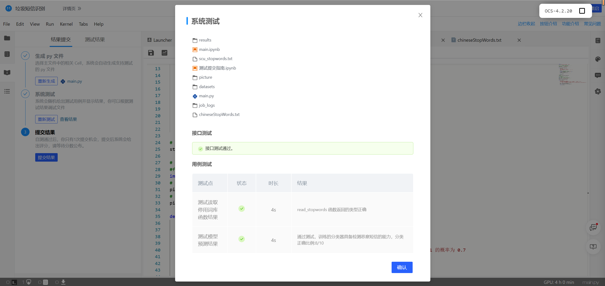

# <center>**程序报告**</center>
### <center>学号：2112492&emsp;&emsp;&emsp;&emsp;&emsp;&emsp;姓名：刘修铭</center>

&nbsp;
## **一、问题重述**
>**垃圾短信识别**：通过在所给数据集上进行机器学习模型训练，实现对垃圾短信的分类识别功能。     
>&nbsp;
>**实验要求**：
>
>（1）任务提供包括数据读取、基础模型、模型训练等基本代码
>（2）参赛选手需完成核心模型构建代码，并尽可能将模型调到最佳状态
>（3） 模型单次推理时间不超过 10 秒

### 对问题的理解     
* 实验平台上给出了需要训练的数据集，我们要实现的是对所给数据集进行数据读取、文本处理、特征工程、模型训练、调整参数等。 

  ​      

## **二、设计思想**
### **2.1 算法流程**
* #### **数据读取**：

  * 调用 pandas 包，使用其中的 pandas.read_csv() 来读取csv文件。打印前几行数据观察文件结构。

  * 通过 csv 文件中的数据结构，取特征值 X 和目标值 y，并且划分测试集与训练集。

* #### 数据处理：

  * 读取停用词表：写一个读取函数，将停用词 txt 文件中的停用词读取到列表中。
    * 本实验测试了两种停用词表，一种是四川大学的停用词表，另一种是网上参考的停用词表。
  * 将文本向量化：有以下两种方法（本实验测试了两种方法，最后采用 TF - IDF 方法）——
    * CountVectorizer：统计每个词出现的次数，将一句话中的词频整合作为向量，用于后面的训练。
    * TfidfVectorizer：使用 TF-IDF 算法。TF：词频，IDF：逆向文件频率，TF - IDF = TF * IDF。以 TF 和 IDF 的乘积作为特征空间坐标系的取值测度，并用它完成对权值 TF 的调整，调整权值的目的在于突出重要单词，抑制次要单词。在本质上 IDF 是一种试图抑制噪声的加权，并且单纯地认为文本频率小的单词就越重要，文本频率大的单词就越无用。
  * StandardScaler：标准化，将数据按比例缩放，使之落入一个小的特定区间，将数据转化为无量纲的纯数值。防止因为数量级不同降低模型精度。

* #### 分类器选择：

  * ##### 分类器选择思路：

    * 贝叶斯方法：
      1. GaussianNB      先验为高斯分布的朴素贝叶斯，适合于特征分布大部分是连续值的样本。
      2. MultinomialNB 先验为多项式分布的朴素贝叶斯，适合于特征的分大部分是多元离散值的样本。
      3. BernoulliNB      先验为伯努利分布的朴素贝叶斯，适合于特征是二元离散值或稀疏的多元离散值的样本。
         * 分析本实验所用的样本集，是向量化之后的文本特征值，属于多元离散的样本分布，因此判断 MultinomialNB 会更适合，经实验验证，MultinomialNB 分类效果确实优于其他两种。

    * 决策树 / 随机森林 / K近邻 / 支持向量机 ：

      1. 决策树和随机森林：接近人的逻辑思维，对数据集的特征决策建树。

      2. 支持向量机：将低维无序杂乱的数据通过核函数映射到高维空间，通过超平面将其分开。

      3. K近邻：寻找特征空间中最邻近的 k 个样本属于某一个类别。
         * 以上几种方法模型复杂度不低，所以它们都有一个共同的问题——如果数据集很大，则会非常耗时。本实验的数据集有78万多条，在训练复杂的模型会导致耗时很长，因此这些模型不适合本实验。

    * AdaBoosting：

      组合许多“弱”分类器来产生一个强大的分类器组，在每次训练的基础上不断调整提升错误样本权重，降低正确样本权重，让后面的学习器能高度关注训练时预测错误的样本。

      然而，将该方法应用于本实验，最后结果不如贝叶斯方法。

  * 综合以上，在尝试众多可能的算法模型之后，发现先验为多项式分布的朴素贝叶斯可能更适合本实验。

  * **分类器实际选择：**

    经上文的讨论，基于多项式的朴素贝叶斯效果较好，下面对其进行一些改进：

    * ***ComplementNB***      CNB是标准多项式朴素贝叶斯算法的一种自适应算法，旨在纠正标准多项朴素贝叶斯分类器所做的“严重假设”。CNB的参数估计比MNB的参数估计更稳定，它在文本分类任务方面经常优于MNB(通常以相当大的幅度)。
      * 因此本实验采用 ***ComplementNB*** 模型对数据集分类。


* #### 模型搭建、训练、预测：

  * 构建*** PipLine***：
    * 本实验最终选择使用：TfidfVectorizer + 停用词表，StandardScaler，以及 ComplementNB 搭建模型。因此在 pipline 里传入这三个参数。
  * 在搭建好的*** PipLine*** 中调用 fit 函数先对训练集进行训练，再在测试集观察训练情况。
    * 在测试集上分析其混淆矩阵及评测指标：
      * Accuracy： (TP + TN) / (TP + FP + FN + TN) 表示模型预测正确的比例
      * Precision：TP / (TP + FP)	表示模型正确预测正类的频率
      * Recall：      TP / (TP + FN)    表示在所有实际正类的标签中，模型正确识别了几个
      * F1 =             2 / (1 / Precision + 1 / Recall ) 精确率与召回率的调和平均值
  * 观察发现测试集分类良好，再在所有的样本上训练一次，充分利用已有的数据，提高模型的泛化能力。
  * 将训练好的最终模型保存到 result 目录下。 
  * 在保存目录加载之前训练好的模型，使用 predict 模块进行预测与检验。


### **2.2  代码具体实现**

* #### **数据读取**

  1. 导入相关的包，利用 pandas 中的 read_csv 读取：
```python
# 导入相关的包
import warnings
warnings.filterwarnings('ignore')
import os
os.environ["HDF5_USE_FILE_LOCKING"] = "FALSE"
import pandas as pd
import numpy as np
```

```python
# 数据集的路径
data_path = "./datasets/5f9ae242cae5285cd734b91e-momodel/sms_pub.csv"
# 读取数据
sms = pd.read_csv(data_path, encoding='utf-8')
# 显示前 5 条数据
sms.head()
```


2. sms 由 标签 label、分词前的 message 、分词后的msg_new 组成，根据 sms 的数据集结构，取特征值 X ，目标值 y，并且划分测试集与训练集。
   * 根据 sms 的数据集结构，取 msg_new 作为特征值 X ，label 作为目标值 y
   * 设置测试集占0.1，训练集占0.9，随机数种子为42

```python
# 构建训练集和测试集
from sklearn.model_selection import train_test_split
X = np.array(sms.msg_new)
y = np.array(sms.label)
X_train, X_test, y_train, y_test = train_test_split(X, y, random_state=42, test_size=0.1)
```


* #### **数据处理**

1. 读取停用词表：
   * 本实验测试了两种停用词表，发现效果差异很小。

  ```python
  # ---------- 停用词库路径，若有变化请修改 -------------
  #stopwords_path = r'scu_stopwords.txt'
  stopwords_path = r'chineseStopWords.txt'
  # ---------------------------------------------------
  
  def read_stopwords(stopwords_path):
      """
      读取停用词库
      :param stopwords_path: 停用词库的路径
      :return: 停用词列表，如 ['嘿', '很', '乎', '会', '或']
      """
      # ----------- 请完成读取停用词的代码 ------------
      with open(stopwords_path, 'r', encoding='utf-8') as f:
          stopwords = f.read()
      stopwords = stopwords.splitlines()
      #----------------------------------------------
      
      return stopwords
  
  # 读取停用词
  stopwords = read_stopwords(stopwords_path)
  ```

2. 文本向量化：

```python
from sklearn.feature_extraction.text import TfidfVectorizer
TfidfVectorizer(stop_words=stopwords) # 示例代码，最后将这句话应用到pipline
```

3. 标准化：

```python
from sklearn.preprocessing import StandardScaler
StandardScaler(with_mean=False) # 示例代码，最后将这句话应用到pipline
```


* ####  分类器选择与调优

```python
from sklearn.naive_bayes import ComplementNB
ComplementNB(alpha=1)
```
​    补充朴素贝叶斯分类器有以下参数：

```asm
alpha 		# float, default=1.0  
			# 附加的(Laplace/Lidstone)平滑参数(0表示不平滑)
fit_prior	# bool, default=True  
			# 是否学习类别先验概率。如果为False，将使用统一的先验。
class_prior # array-like of shape (n_classes,), default=None 
			# 类别的先验概率。一经指定先验概率不能随着数据而调整。
norm		# bool, default=False
			# 是否对权重进行第二次标准化。
```
调整参数之后，发现有平滑的比没有平滑的效果更好，且alpha=1时，效果最好。

本实验没有统一的类别先验概率，所以 fit_prior、class_prior 使用默认参数。

测试 norm ，发现对权重进行第二次标准化的结果不如不进行标准化，因此 norm 也设为 False。
&nbsp;

* #### 模型搭建、训练

1. 构建 ***PipLine***

   使用 TF-IDF 向量化、标准化、ComplementNB 模型

```python
from sklearn.pipeline import Pipeline
# pipline_list用于传给Pipline作为参数
pipeline_list = [
    # --------------------------- 需要完成的代码 ------------------------------
    
    ('tf', TfidfVectorizer(stop_words=stopwords)),
    ('ss',StandardScaler(with_mean=False)),
    ('classifier', ComplementNB(alpha=1))
    
    # ------------------------------------------------------------------------
]
# 搭建 pipeline
pipeline = Pipeline(pipeline_list)
```


2. 在训练集和测试机进行训练与评估

```python
# 训练 pipeline
pipeline.fit(X_train, y_train)

# 对测试集的数据集进行预测
y_pred = pipeline.predict(X_test)

# 在测试集上进行评估
from sklearn import metrics
print("在测试集上的混淆矩阵：")
print(metrics.confusion_matrix(y_test, y_pred))
print("在测试集上的分类结果报告：")
print(metrics.classification_report(y_test, y_pred))
```

* 最终在测试集上的分类结果达到 0.99 的准确率，0.99 的精确率，以及其他很好的指标。

  


3. 在所有样本训练一次，提高泛化能力，并保存训练好的模型

```python
# 在所有的样本上训练一次，充分利用已有的数据，提高模型的泛化能力
pipeline.fit(X, y)
# 保存训练的模型，请将模型保存在 results 目录下
from sklearn.externals import joblib
pipeline_path = 'results/pipeline.model'
joblib.dump(pipeline, pipeline_path)
```


* #### 模型预测

1. 加载训练好的模型

```python
# 加载训练好的模型
from sklearn.externals import joblib
# ------- pipeline 保存的路径，若有变化请修改 --------
pipeline_path = 'results/pipeline.model'
# --------------------------------------------------
pipeline = joblib.load(pipeline_path)
```
2. 预测

```python
def predict(message):
    """
    预测短信短信的类别和每个类别的概率
    param: message: 经过jieba分词的短信，如"医生 拿 着 我 的 报告单 说 ： 幸亏 你 来 的 早 啊"
    return: label: 整数类型，短信的类别，0 代表正常，1 代表恶意
            proba: 列表类型，短信属于每个类别的概率，如[0.3, 0.7]，认为短信属于 0 的概率为 0.3，属于 1 的概率为 0.7
    """
    label = pipeline.predict([message])[0]
    proba = list(pipeline.predict_proba([message])[0])
    return label, proba
```

3. 测试用例
```python
# 测试用例
label, proba = predict('医生 拿 着 我 的 报告单 说 ： 幸亏 你 来 的 早 啊')
print(label, proba)
```

   

## **三、完整代码**

### （一）模型训练
```Python
import os
os.environ["HDF5_USE_FILE_LOCKING"] = "FALSE"

# ---------- 停用词库路径，若有变化请修改 -------------
#stopwords_path = r'scu_stopwords.txt'
stopwords_path = r'chineseStopWords.txt'

# ---------------------------------------------------

def read_stopwords(stopwords_path):
    """
    读取停用词库
    :param stopwords_path: 停用词库的路径
    :return: 停用词列表，如 ['嘿', '很', '乎', '会', '或']
    """
    stopwords = []
    # ----------- 请完成读取停用词的代码 ------------
    with open(stopwords_path, 'r', encoding='utf-8') as f:
        stopwords = f.read()
    stopwords = stopwords.splitlines()
    #----------------------------------------------
    
    return stopwords

# 读取停用词
stopwords = read_stopwords(stopwords_path)
#print(stopwords)

# ----------------- 导入相关的库 -----------------
from sklearn.pipeline import Pipeline
from sklearn.feature_extraction.text import CountVectorizer
from sklearn.naive_bayes import BernoulliNB
from sklearn.naive_bayes import MultinomialNB
from sklearn.naive_bayes import ComplementNB
import pandas as pd
import numpy as np


#读取数据
data_path = "./datasets/5f9ae242cae5285cd734b91e-momodel/sms_pub.csv"
sms = pd.read_csv(data_path, encoding='utf-8')

# 构建训练集和测试集
from sklearn.model_selection import train_test_split
X = np.array(sms.msg_new)
y = np.array(sms.label)
X_train, X_test, y_train, y_test = train_test_split(X, y, random_state=42, test_size=0.1)
print("总共的数据大小", X.shape)
print("训练集数据大小", X_train.shape)
print("测试集数据大小", X_test.shape)

from sklearn.pipeline import Pipeline
from sklearn.feature_extraction.text import TfidfVectorizer
from sklearn.preprocessing import StandardScaler
from sklearn.naive_bayes import ComplementNB

# pipline_list用于传给Pipline作为参数
pipeline_list = [
    # --------------------- 需要完成的代码 ------------------------------
    
    # ==================== 以下代码仅供参考 =============================
#    ('cv', CountVectorizer(token_pattern=r"(?u)\b\w+\b", stop_words=stopwords)),
#    ('classifier', MultinomialNB())
    # ========================================================================
    ('tf', TfidfVectorizer(stop_words=stopwords)),
    ('ss',StandardScaler(with_mean=False)),
    ('classifier', ComplementNB(alpha=1))
    
    # ------------------------------------------------------------------
]

# 搭建 pipeline
pipeline = Pipeline(pipeline_list)

# 训练 pipeline
pipeline.fit(X_train, y_train)

# 对测试集的数据集进行预测
y_pred = pipeline.predict(X_test)

# 在测试集上进行评估
from sklearn import metrics
print("在测试集上的混淆矩阵：")
print(metrics.confusion_matrix(y_test, y_pred))
print("在测试集上的分类结果报告：")
print(metrics.classification_report(y_test, y_pred))
print("在测试集上的 f1-score ：")
print(metrics.f1_score(y_test, y_pred))

# 在所有的样本上训练一次，充分利用已有的数据，提高模型的泛化能力
pipeline.fit(X, y)
# 保存训练的模型，请将模型保存在 results 目录下
#from sklearn.externals import joblib
import joblib
pipeline_path = 'results/pipeline.model'
joblib.dump(pipeline, pipeline_path)
```

### （二）main提交
```python
import os
os.environ["HDF5_USE_FILE_LOCKING"] = "FALSE"

# ---------- 停用词库路径，若有变化请修改 -------------
#stopwords_path = r'scu_stopwords.txt'
stopwords_path = r'chineseStopWords.txt'
# ---------------------------------------------------

def read_stopwords(stopwords_path):
    """
    读取停用词库
    :param stopwords_path: 停用词库的路径
    :return: 停用词列表，如 ['嘿', '很', '乎', '会', '或']
    """
    stopwords = []
    # ----------- 请完成读取停用词的代码 ------------
    with open(stopwords_path, 'r', encoding='utf-8') as f:
        stopwords = f.read()
    stopwords = stopwords.splitlines()
    #----------------------------------------------
    
    return stopwords

# 读取停用词
stopwords = read_stopwords(stopwords_path)

# 加载训练好的模型
#from sklearn.externals import joblib
import joblib
# ------- pipeline 保存的路径，若有变化请修改 --------
pipeline_path = 'results/pipeline.model'
# --------------------------------------------------
pipeline = joblib.load(pipeline_path)

def predict(message):
    """
    预测短信短信的类别和每个类别的概率
    param: message: 经过jieba分词的短信，如"医生 拿 着 我 的 报告单 说 ： 幸亏 你 来 的 早 啊"
    return: label: 整数类型，短信的类别，0 代表正常，1 代表恶意
            proba: 列表类型，短信属于每个类别的概率，如[0.3, 0.7]，认为短信属于 0 的概率为 0.3，属于 1 的概率为 0.7
    """
    label = pipeline.predict([message])[0]
    proba = list(pipeline.predict_proba([message])[0])
    
    return label, proba
```

&nbsp;

## **四、实验结果**

* 平台检测结果：

&nbsp;
## **五、总结**
* 本实验相比于平台上给出的示例进行了如下优化：
  * 换用停用词表，比较两种停用词表的结果，发现结果相差不大；
  * 改用 TF-IDF + 标准化 StandardScaler 进行数据处理；
  * 将原来的 MultinomialNB 基于多项式的朴素贝叶斯 换成 ComplementNB，该模型也是基于多项式的朴素贝叶斯，但是旨在纠正标准多项朴素贝叶斯分类器所做的“严重假设”。参数估计更稳定。
  * 尝试调参，最后发现默认参数效果最佳。

* 通过本实验，熟悉了自然语言处理与二分类问题的基本流程与相关细节，有助于更好理解人工智能与机器学习。

