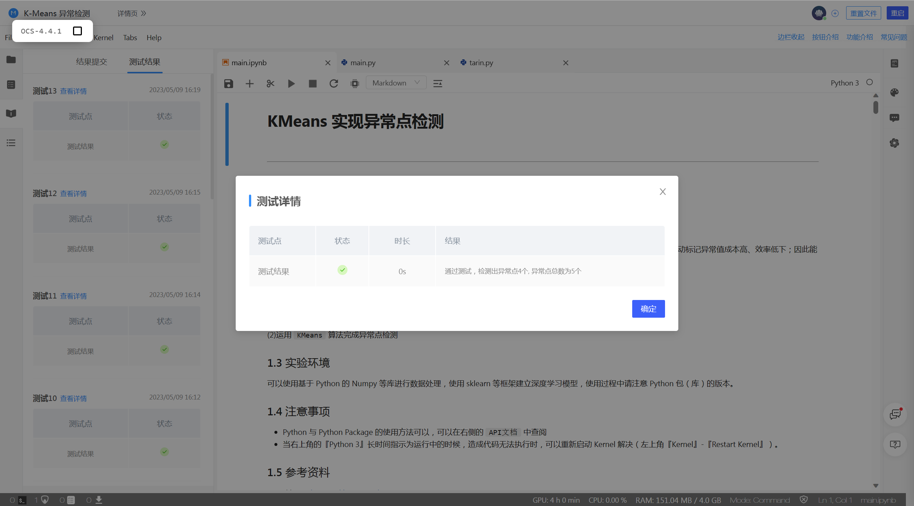

# <center>**程序报告**</center>
### <center>学号：2112492&emsp;&emsp;&emsp;&emsp;&emsp;&emsp;姓名：刘修铭</center>

&nbsp;

## **一、问题重述**

>**K-means 异常检测**：通过自己实现 K-means 聚类算法，在提供的数据集中进行异常点检测。     
>&nbsp;
>**实验要求**：
>
>(1)了解 `KMeans`、`PCA` 算法，了解算法的基本原理
>(2)运用 `KMeans` 算法完成异常点检测

### 对问题的理解     
* 平台上给出了数据集，我们需要对数据集进行预处理、特征工程、聚类、判断异常点。 

  ​      

## **二、设计思想 & 代码** 
### **2.1 算法流程**
* #### **数据处理**：

  * 调用 pandas 包，使用其中的 pandas.read_csv() 来读取csv文件。
  * 再利用 pandas.merge，将两张 DataFrame 表按时间连接。

* #### **特征工程**：

  * 构建特征：
    * 首先，最基础的特征就是原始数据中的 cpc、cpm。
    * 然后，将 timestamp 列转换为时间类型，取出时间类型中的 hour，将 hour 在7~22的计算出来作为新的特征值 “daylight”。
    * 并且，引入非线性关系 “cpc X cpm”、“cpc / cpm”。
  * 标准化：使用 StandardScaler() 进行标准化。
  * 降维：使用主成分分析法，将特征维度从原来的五维下降到三维。

* #### 聚类算法：

  * 首先：根据要聚类的个数，随机初始化各个簇的中心。
  * 根据当前各个簇中心，计算每个数据点与各个簇中心的距离，将该点划分为距离簇中心最近的簇类别。
  * 根据重新划分的簇，更新每个簇的中心位置。直至簇中心不再变化时停止优化。


* #### 模型搭建、预测：

  * 根据聚类算法利用传入的数据集进行训练，保存训练出的簇中心、分类标签等数据。
  * 计算样本点与聚类中心的距离，设置异常点比例，据此求出阈值距离。
  * 根据计算出的阈值距离，判断是否为异常点。


### **2.2  代码具体实现**

* #### **数据处理 + 特征工程**

  * ***preprocess_data( )*** 将原始的 csv 数据（DataFrame类型）进行特征构建、标准化与主成分分析降维。
```python
def preprocess_data(df):
    """
    数据处理及特征工程等
    :param df: 读取原始 csv 数据，有 timestamp、cpc、cpm 共 3 列特征
    :return: 处理后的数据, 返回 pca 降维后的特征
    """
    # 请使用joblib函数加载自己训练的 scaler、pca 模型，方便在测试时系统对数据进行相同的变换
    # ====================数据预处理、构造特征等========================

    df['timestamp'] = pd.to_datetime(df['timestamp'])
    df['hours'] = df['timestamp'].dt.hour
    df['daylight'] = ((df['hours'] >= 7) & (df['hours'] <= 22)).astype(int)
    df['cpc X cpm'] = df['cpm'] * df['cpc']
    df['cpc / cpm'] = df['cpc'] / df['cpm']

    # ========================  模型加载  ===========================
    columns = ['cpc', 'cpm', 'cpc X cpm', 'cpc / cpm','daylight']
    data = df[columns]

    # 标准化 + 降维
    scaler = joblib.load('./results/scaler.pkl') #scaler = StandardScaler()
    data = scaler.fit_transform(data)

    pca = joblib.load('./results/pca.pkl') #pca = PCA(n_components=n_components)
    data = pca.fit_transform(data)

    # 将array类型的data变为DataFrame类型，返回DataFrame类型数据
    n_components = data.shape[1]
    data = pd.DataFrame(data,columns=['Dimension' + str(i+1) for i in range(n_components)])

    return data
```


* #### **聚类算法**

  * 首先将 ***best_centers、best_labels*** 初始化为 np.array 类型，并把数据 ***x*** 初始化为 np.array 类型。

  * 随机选取 data 中的 n_clusters 个点为初始化的质心

    * 使用 ***random.randint(a,b,c)*** 方法随机生成一个整数，从a到b，生成c个
    * 数据范围从 0 到 data.shape[0]（data行数），生成 ***self.n_clusters*** 个

    ````python
    best_centers=x[np.random.randint(0,x.shape[0],self.n_clusters),:]
    ````

  * 计算距离矩阵

    * 使用导入的 ***cdist*** 函数，得到的是（data行数 * n_clusters）的矩阵

    （每一行代表一个样本点到所有质心的距离，一行里 n_clusters 个值分别指到第几个质心的距离）

    ```python
    distances=cdist(x,best_centers) 
    ```

  * 计算每个样本点的分类

    * 使用 ***np.argmin*** 函数，对距离按由近到远排序，选取最近的质心点的类别作为当前点的分类
    * 参数 axis=1 ，每一行取最小值，最后结果保存为一列（data行数 * 1 的矩阵）

    ```python
    c_index=np.argmin(distances,axis=1)
    ```

  * 对每一类数据进行均值计算，更新质心点坐标

    * 对于每一个在 `c_index ` 出现的类别 i，选出所有类别是 i 的点，取data里面坐标的均值，更新第 i 个质心
    * c_indexi 逻辑判断表达式，结果为布尔类型（数组）。c_index 为一个数组，data[c_indexi] 返回结果为true对应的 data 的值，即类别为i的值的坐标

    ```python
    for i in range(self.n_clusters):
    	if i in c_index:  
    		best_centers[i]=np.mean(x[c_index==i],axis=0)
    ```

  * ##### 完整代码如下：

  ```python
  class KMeans():
    """
    Parameters
    ----------
    n_clusters 指定了需要聚类的个数，这个超参数需要自己调整，会影响聚类的效果
    n_init 指定计算次数，算法并不会运行一遍后就返回结果，而是运行多次后返回最好的一次结果，n_init即指明运行的次数
    max_iter 指定单次运行中最大的迭代次数，超过当前迭代次数即停止运行
    """
    def __init__(
                self,
                n_clusters=8,
                n_init=10,
                max_iter=300
                ):
  
        self.n_clusters = n_clusters
        self.max_iter = max_iter
        self.n_init = n_init
  
  
    def fit(self, x):
        """
        用fit方法对数据进行聚类
        param x: 输入数据
        :best_centers: 簇中心点坐标 数据类型: ndarray
        :best_labels: 聚类标签 数据类型: ndarray
        :return: self
        """
   ###################################################################################
          #### 请勿修改该函数的输入输出 ####
   ###################################################################################
          # #
        best_centers=np.array([])
        best_labels=np.array([])
        x=np.array(x)
          
        # 初始化质心
        best_centers=x[np.random.randint(0,x.shape[0],self.n_clusters),:] 
              
        #开始迭代
        for i in range(self.max_iter):
            #1.计算距离矩阵
            distances=cdist(x,best_centers) 
              
            #2.对距离按由近到远排序，选取最近的质心点的类别作为当前点的分类
            c_index=np.argmin(distances,axis=1)  
              
            #3.均值计算，更新质心点坐标
            for i in range(self.n_clusters):
                if i in c_index:  
                    best_centers[i]=np.mean(x[c_index==i],axis=0)  
                      
        each_dist=cdist(x,best_centers)
        each_label=np.argmin(each_dist,axis=1)
        best_labels=each_label
          # #
   ###################################################################################
          ############# 在生成 main 文件时, 请勾选该模块 ############# 
   ###################################################################################
  
        self.cluster_centers_ = best_centers
        self.labels_ = best_labels
        return self
  ```


* ####  模型搭建、预测

  * 计算样本点与聚类中心的距离

  ```python
  def get_distance(data, kmeans, n_features):
    """
    计算距离函数
    :param data: 训练 kmeans 模型的数据
    :param kmeans: 训练好的 kmeans 模型
    :param n_features: 计算距离需要的特征的数量
    :return: 每个点距离自己簇中心的距离
    """
    distance = []
    for i in range(0,len(data)):
        point = np.array(data.iloc[i,:n_features])
        center = kmeans.cluster_centers_[kmeans.labels_[i],:n_features]
        distance.append(np.linalg.norm(point - center))
    distance = pd.Series(distance)
    return distance
  ```

  * 判断异常点
    * 参数 ratio 为异常点的比率，先调用 `get_distance` 添加距离列，据此和 ratio 计算阈值距离，然后判断是否为异常点。

  ```python
  def get_anomaly(data, kmean, ratio):
    """
    检验出样本中的异常点，并标记为 True 和 False，True 表示是异常点
  
    :param data: preprocess_data 函数返回值，即 pca 降维后的数据，DataFrame 类型
    :param kmean: 通过 joblib 加载的模型对象，或者训练好的 kmeans 模型
    :param ratio: 异常数据占全部数据的百分比,在 0 - 1 之间，float 类型
    :return: data 添加 is_anomaly 列，该列数据是根据阈值距离大小判断每个点是否是异常值，元素值为 False 和 True
    """
      # ====================检验出样本中的异常点========================
    num_anomaly = int(len(data) * ratio)
  
      # 添加中间列 distance
    data['distance'] = get_distance(data[data.columns],kmean,7)
  
      # 计算阈值距离
    threshould = data['distance'].sort_values(ascending=False).reset_index(drop=True)[num_anomaly]
    data['is_anomaly'] = data['distance'].apply(lambda x: x > threshould)
  
    return data
  ```

  * 预测：
    * 在此函数中加载 预先训练好的 `Kmeans` 模型，调用 `get_anomaly` 函数，得到添加了判断结果的 data 数据。

  ```python
  def predict(preprocess_data):
    """
    该函数将被用于测试，请不要修改函数的输入输出，并按照自己的模型返回相关的数据。
    在函数内部加载 kmeans 模型并使用 get_anomaly 得到每个样本点异常值的判断
    :param preprocess_data: preprocess_data函数的返回值，一般是 DataFrame 类型
    :return:is_anomaly:get_anomaly函数的返回值，各个属性应该为（Dimesion1,Dimension2,......数量取决于具体的pca），distance,is_anomaly，请确保这些列存在
            preprocess_data:  即直接返回输入的数据
            kmeans: 通过joblib加载的对象
            ratio:  异常点的比例，ratio <= 0.03   返回非异常点得分将受到惩罚！
    """
      # 异常值所占比率
    ratio = 0.022
      # 加载模型
    kmeans = joblib.load('./results/model.pkl')
      # 获取异常点数据信息
    use_data=preprocess_data[:]
    is_anomaly = get_anomaly(use_data, kmeans, ratio)
  
    return is_anomaly, preprocess_data, kmeans, ratio
  ```


* #### 模型调优

改变迭代次数和聚类中心个数，利用评价指标 `calinski_harabasz_score` 和 `silhouette_score` 评估当前模型，选出较好的聚类结果。

最后结果可视化如下：


## **三、实验结果**

* 平台检测结果：



## **五、总结**
* 通过本实验，熟悉了聚类算法的具体实现流程，有助于更好理解无监督学习。
* 学习了主成分分析、可视化样本点、pandas、numpy 等的 python 方法。
