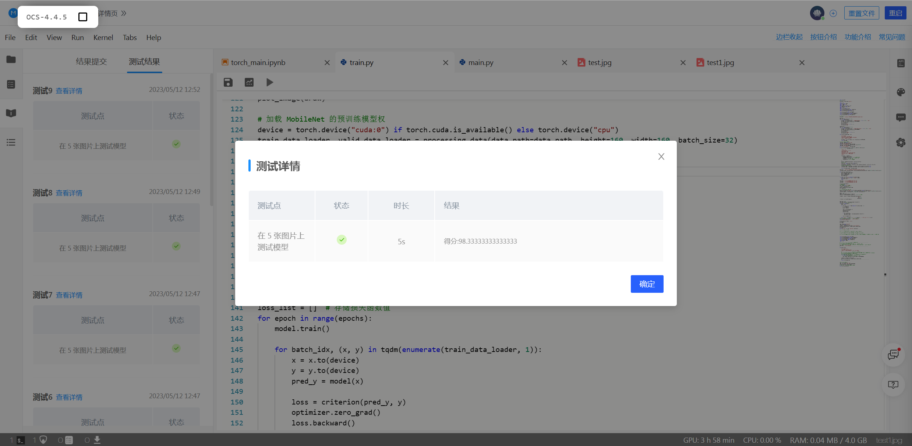

# <center>**程序报告**</center>
### <center>学号：2112492&emsp;&emsp;&emsp;&emsp;&emsp;&emsp;姓名：刘修铭</center>

&nbsp;
## **一、问题重述**
>**口罩佩戴检测**：建立模型检测图像中的人的口罩佩戴情况。     
>&nbsp;
>**实验要求**：
>
>1）建立深度学习模型，检测出图中的人是否佩戴了口罩，并将其尽可能调整到最佳状态。
>2）学习经典的模型 MTCNN 和 MobileNet 的结构。
>3）学习训练时的方法。

### 对问题的理解     
* 平台上给出了具体的框架和流程，我们需要掌握深度学习模型的框架和流程 ，调整模型，使得训练达到更好的效果，并且学习这种训练的方法，以应用于更多方面。

  ​      

## **二、设计思想 & 代码** 
* #### **加载数据 & 数据处理**

  创建训练时所需要的批量数据集

  * 创建一个 `Dataset` 对象：使用通用的数据加载器——**torchvision.datasets.ImageFolder** 
    * 先定义好对图片进行预处理的操作（函数）`transform `，原始图片作为输入，返回一个转换后的图片。
    * 调用 `torchvision.datasets.ImageFolder` 函数，传入图片的根目录和 `transform` 预处理函数。
  * 创建一个 `DataLoader` 对象：使用 `torch.utils.data.DataLoader` 包装数据
    * 先划分数据集，根据参数 `test_split` 的比例划分训练和测试集
    * 创建 `DataLoader` 对象，设置每一个 batch 加载样本的组数为传入的batch_size参数（32），并且每一个 epoch 之后对样本进行随机打乱。
```python
def processing_data(data_path, height=224, width=224, batch_size=32,
                    test_split=0.1):
    """
    数据处理部分
    :param data_path: 数据路径
    :param height:高度
    :param width: 宽度
    :param batch_size: 每次读取图片的数量
    :param test_split: 测试集划分比例
    :return: 
    """
    transforms = T.Compose([
        T.Resize((height, width)),
        T.RandomHorizontalFlip(0.1),  # 进行随机水平翻转
        T.RandomVerticalFlip(0.1),  # 进行随机竖直翻转
        T.ToTensor(),  # 转化为张量
        T.Normalize([0], [1]),  # 归一化
    ])

    dataset = ImageFolder(data_path, transform=transforms)
    # 划分数据集
    train_size = int((1-test_split)*len(dataset))
    test_size = len(dataset) - train_size
    train_dataset, test_dataset = torch.utils.data.random_split(dataset, [train_size, test_size])
    # 创建一个 DataLoader 对象
    train_data_loader = DataLoader(train_dataset, batch_size=batch_size,shuffle=True)
    valid_data_loader = DataLoader(test_dataset, batch_size=batch_size,shuffle=True)

    return train_data_loader, valid_data_loader
```


* #### **加载预训练模型**

  本实验中使用已经搭建好的 MTCNN 网络，预训练模型 MobileNet。

  * 调用预处理函数，将数据集划分
  * 调用 `torch.py ` 里写的 `MobileNetV1` 网络，传入classes为2，并且调大epochs
  * 设置优化器 `optimizer`

```python
# 加载 MobileNet 的预训练模型权
device = torch.device("cuda:0") if torch.cuda.is_available() else torch.device("cpu")
train_data_loader, valid_data_loader = processing_data(data_path=data_path, height=160, width=160, batch_size=32)
modify_x, modify_y = torch.ones((32, 3, 160, 160)), torch.ones((32))

epochs = 40
model = MobileNetV1(classes=2).to(device)
optimizer = optim.Adam(model.parameters(), lr=1e-3)  # 优化器
```


* ####  创建模型 & 训练模型

  * 调整学习率

  ```python
  scheduler = optim.lr_scheduler.ReduceLROnPlateau(optimizer,
                                                   'max', 
                                                   factor=0.2,
                                                  patience=12)
  ```

  ​		使用 `optim.lr_scheduler.ReduceLROnPlateau`，根据测试指标调整学习率

  ​		当参考的评价指标停止改进时,降低学习率：`factor`为每次下降的比例；训练过程中，当指标连续`patience` 次数还没有改进时，降低学习率。

  ​		这里调整参数：下降比例是 0.2，patience 是12

  
  * 训练模型

    * 设置外层大循环，共进行 epochs 次训练

      ```
      Epoch（一代训练）：当一个完整的数据集通过了神经网络一次并且返回了一次，这个过程称为一次epoch，一次epoch代表所有训练样本在神经网络中都进行了一次正向传播和一次反向传播。
      ```

    * 设置内层循环，进行分批迭代

      ```
      Batch（一批数据）：当一个epoch的样本（也就是所有的训练样本）数量可能太过庞大，就需要把它分成多个小块，也就是就是分成多个Batch来进行训练。
      ```

    * 在每次训练中，更新记录截至目前为止最好的模型状态，存到 `best_model_weights` 中，最后将这个最好的状态存到模型保存到目录下。

  ```python
  best_loss = 1e9
  best_model_weights = copy.deepcopy(model.state_dict())
  loss_list = []  # 存储损失函数值
  for epoch in range(epochs):
      model.train()
  
      for batch_idx, (x, y) in tqdm(enumerate(train_data_loader, 1)):
          x = x.to(device)
          y = y.to(device)
          pred_y = model(x)
  
          loss = criterion(pred_y, y)
          optimizer.zero_grad()
          loss.backward()
          optimizer.step()
  
          if loss < best_loss:
              best_model_weights = copy.deepcopy(model.state_dict())
              best_loss = loss
              
          loss_list.append(loss)
  
      print('step:' + str(epoch + 1) + '/' + str(epochs) + ' || Total Loss: %.4f' % (loss))
  #torch.save(model.state_dict(), './results/temp.pth')
  torch.save(best_model_weights, './results/temp.pth')
  print('Finish Training.')
  ```


* #### 预测

  * 将 cv2.imread 图像转化为 PIL.Image 图像，用来兼容测试输入的 cv2 读取的图像
  * 加载之前训练好的最优模型
  * 利用训练好的模型进行口罩佩戴识别的预测

  ```python
  def predict(img):
      """
      加载模型和模型预测
      :param img: cv2.imread 图像
      :return: 预测的图片中的总人数、其中佩戴口罩的人数
      """
      # -------------------------- 实现模型预测部分的代码 ---------------------------
      # 将 cv2.imread 图像转化为 PIL.Image 图像，用来兼容测试输入的 cv2 读取的图像（勿删！！！）
      # cv2.imread 读取图像的类型是 numpy.ndarray
      # PIL.Image.open 读取图像的类型是 PIL.JpegImagePlugin.JpegImageFile
      if isinstance(img, np.ndarray):
          # 转化为 PIL.JpegImagePlugin.JpegImageFile 类型
          img = Image.fromarray(cv2.cvtColor(img,cv2.COLOR_BGR2RGB))
      
      recognize = Recognition(model_path)
      img, all_num, mask_num = recognize.mask_recognize(img)
      # -------------------------------------------------------------------------
      return all_num,mask_num
  ```


* #### 模型调优（评估模型）

  在本次实验中，我们主要对以下方向尝试进行了优化：

1. ##### 调整 `epoch` 时期数：

   * epoch：当一个完整的数据集通过了神经网络一次并且返回了一次，这个过程称为一次epoch，即一个 epoch 就是将所有训练样本训练一次的过程。
   * 只在神经网络中传递完整一次数据集是不够的，我们需要将完整的数据集在同样的神经网络中传递多次。因为使用的是有限的数据集，并且我们使用一个迭代过程即梯度下降来优化学习过程。 需要反复多次才能拟合、收敛。
   * 随着epoch 数量的增加， 权重更新迭代的次数增多， 曲线从最开始的不拟合状态， 进入优化拟合状态， 最终进入过拟合。
   * 模型初始设置的epoch为2，过于小，模型可能尚未拟合收敛。因此，我们在调整参数的过程中，逐渐增大epoch，发现其值为40的时候，模型达到较好的效果，再大再小效果都有所下降，因此，我们最后采用40的epoch。

2. ##### 调整学习率：

* `ReduceLROnPlateau` —— 根据训练中某些测量值调整参数

  * optimizer ：优化器

  * mode：min和max两种模型。这里选择 min 模式，表示当优化的指标不再下降时，改变学习数率。

  * factor：学习率下降的比率。我们调整这个factor为0.2，是一个比较缓慢的学习率下降速度。

    当学习率过大会导致网络不能收敛，徘徊在最优值附近；

    学习率过小，会导致网络收敛非常缓慢，从而增大找到最优值的时间；

    相比之下，学习率应该逐渐减缓，设置学习率缓减机制，而这里的factor就是缓减比率。

  * patience：没有改善的时期数，之后学习率将降低。我们调整 `patience = 12` ，表示我们将忽略前 12个没有改善的 epoch，并且仅在第 12 个 epoch 之后损失仍然没有改善的情况下降低 LR。

* 除此之外，实验过程中还尝试了另一种调整学习率的方法：根据训练次数调整学习率，例如：

  * `torch.optim.lr_scheduler.LambdaLR` 

  * `torch.optim.lr_scheduler.StepLR`

  * `torch.optim.lr_scheduler.MultiStepLR`

    然而，这些调整方法的结果没有 `ReduceLROnPlateau` 表现好，因此最后采用根据训练中某些测量值调整参数的方法。

3. ##### 加深神经网络：

   在 MobileNetV1.py 文件中更改神经网络的深度，将卷积层加深，如下：

   ```python
   self.mobilebone = nn.Sequential(
               self._conv_bn(3, 32, 2),
               self._conv_dw(32, 64, 1),
               self._conv_dw(64, 128, 2),
               self._conv_dw(128, 128, 1),
               self._conv_dw(128, 256, 2),
               # self._conv_dw(256, 256, 1),
               # self._conv_dw(256, 512, 2),
               # self._top_conv(512, 512, 5),
               # self._conv_dw(512, 1024, 2),
               # self._conv_dw(1024, 1024, 1),
           )
   ```

   并注意将空间维度对应拓宽

   ```python
   self.fc = nn.Linear(256, classes)
   ```


## **三、实验结果**   
* 平台检测结果：

 

* 经过以上调优方式，可以看到，模型在图片预测上达到了更好的效果。


## **五、总结**
* 通过本实验，熟悉了深度学习模型的训练流程，学习了经典的模型 MTCNN 和 MobileNet 的结构。
* 通过调整参数的过程，明白了相关参数的意义以及其对网络的作用，对进一步了解网络起到了作用。并且通过调整模型，使得其检测达到了相对较好的状态。

