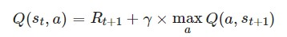
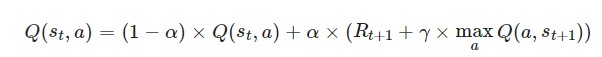
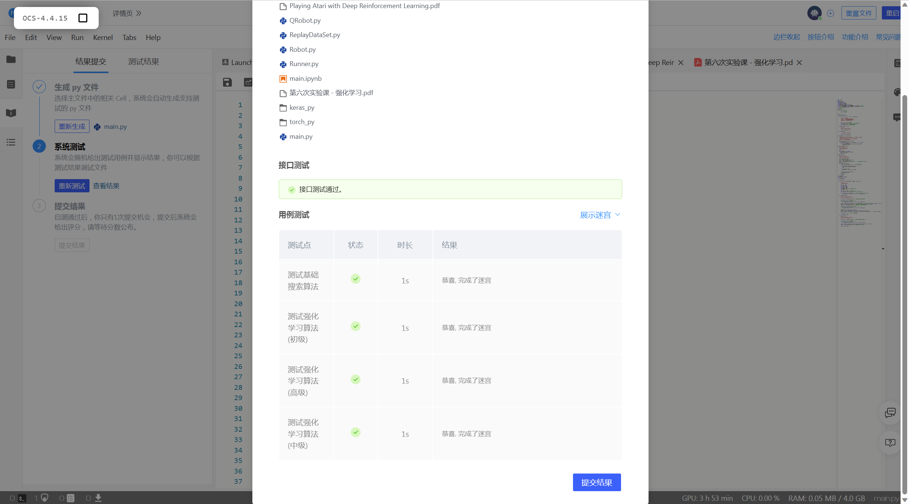
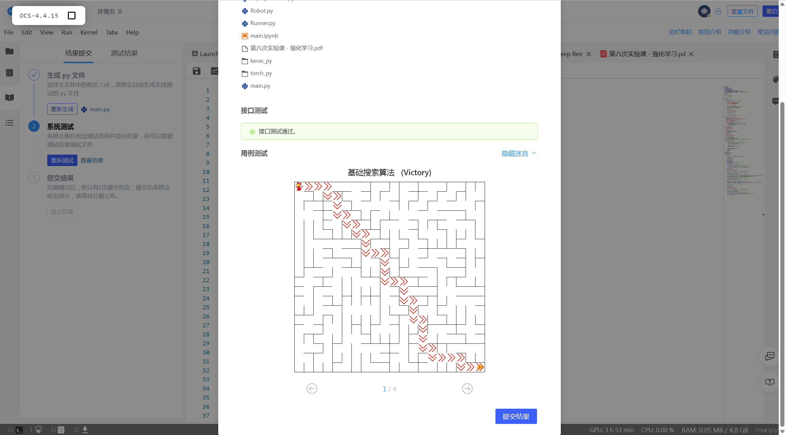
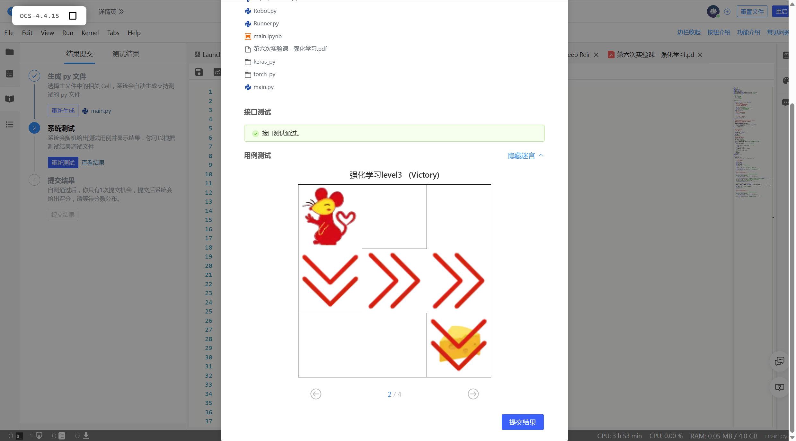
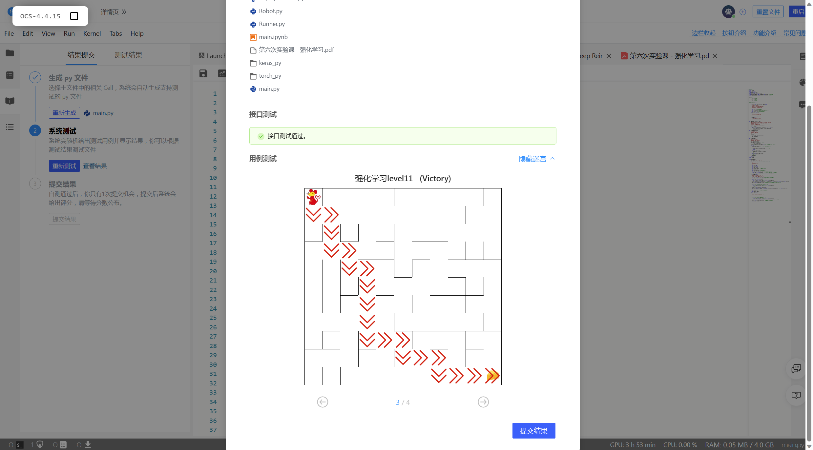
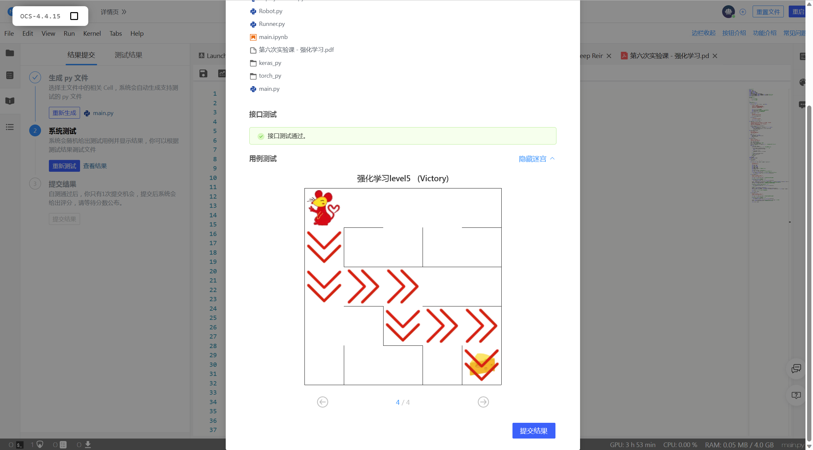

# <center>**程序报告**</center>
### <center>学号：2112492&emsp;&emsp;&emsp;&emsp;&emsp;姓名：刘修铭</center>


## **一、问题重述**

>**机器人自动走迷宫**：分别使用基础搜索算法和 Deep QLearning 算法，完成机器人自动走迷宫。

>游戏规则为:从起点开始，通过错综复杂的迷宫，到达目标点(出口)。
>
>在任一位置可执行动作包括：向上走 `'u'`、向右走 `'r'`、向下走 `'d'`、向左走 `'l'`。
>
>- 执行不同的动作后，根据不同的情况会获得不同的奖励，具体而言，有以下几种情况。
>  - 撞墙
>  - 走到出口
>  - 其余情况
>- 需要实现基于基础搜索算法和 Deep QLearning 算法的机器人，使机器人自动走到迷宫的出口。

### 对问题的理解     

* 自己实现基础算法和强化学习算法。其中，基础算法主要是搜索算法，强化学习算法则更加侧重于根据智能体与环境的交互来学习。

&nbsp;

## **二、设计思想**

### <center>2.1 基础算法</center>

* #### 广度优先搜索

1. 首先以机器人起始位置建立根节点，并入队；

2. 接下来不断重复以下步骤直到判定条件：

   * 将队首节点的位置标记已访问；判断队首是否为目标位置(出口)， 若是则终止循环并记录回溯路径；

   * 判断队首节点是否为叶子节点，若是则拓展该叶子节点

   * 如果队首节点有子节点，则将每个子节点插到队尾

   * 将队首节点出队

     

* #### 深度优先搜索

1. 首先将根节点放入stack中。
2. 从stack中取出第一个节点，并检验它是否为目标。
   如果找到目标，则结束搜寻并回传结果。  
   否则将它某一个尚未检验过的直接子节点加入stack中。
3. 重复步骤2。
4. 如果不存在未检测过的直接子节点。
   将上一级节点加入stack中。  
   重复步骤2。
5. 重复步骤4。
6. 若stack为空，表示整张图都检查过了——亦即图中没有欲搜寻的目标。结束搜寻并回传“找不到目标”。


### <center>2.2 Deep QLearning算法</center>

#### QLearning 算法要点：

* Q-Learning 算法是值迭代算法。
* Q-Learning 算法在执行过程中会计算每个”状态“或”状态-动作“的 Value，然后在执行动作的时候，会设法最大化这个值。算法（值迭代）的核心在于对每个状态值的准确估计。
* 考虑最大化动作的长期奖励——考虑当前动作带来的奖励 + 考虑动作长远的奖励。


#### QLearning 算法步骤：

##### 1. 获取机器人所处迷宫位置

##### 2. 对当前状态，检索Q表，如果不存在则添加进入Q表

##### 3. 选择动作

* 为了防止出现  因机器人每次都选择它认为最优的路线而导致的路线固定（缺乏有效探索） 的现象，通常采用 *epsilon-greedy* 算法：
  * 在机器人选择动作的时候，以一部分的概率随机选择动作，以一部分的概率按照最优的 Q 值选择动作。
  * 同时，这个选择随机动作的概率应当随着训练的过程逐步减小。

##### 4. 以给定的动作（移动方向）移动机器人

##### 5. 获取机器人执行动作后所处的位置

##### 6. 对当前 next_state ，检索Q表，如果不存在则添加进入Q表

##### 7. 更新 Q 表 中 Q 值以及其他参数

* Q表（Q_table）：

  * Q-learning 算法将状态和动作构建成一张 Q_table 表来存储 Q 值；

  * Q-Learning 算法中，长期奖励记为 Q 值，其中会考虑每个 ”状态-动作“ 的 Q 值，计算公式为：

    

    * （St，a）：当前的 “ 状态-动作 ”

    * Rt+1：执行动作 a 后的环境奖励
    * maxQ(a，St+1)：执行任意动作能够获得的最大的Q值
    * γ：折扣因子

  * 然而，计算得到新的 Q 值之后，一般会使用更为保守地更新 Q 表的方法，即引入松弛变量 alpha ，按如下的公式进行更新，使得 Q 表的迭代变化更为平缓。

    


## **三、代码内容**


* #### 基础算法

```python
# 导入相关包 
import os
import random
import numpy as np
from Maze import Maze
from Runner import Runner
from QRobot import QRobot
from ReplayDataSet import ReplayDataSet
from torch_py.MinDQNRobot import MinDQNRobot as TorchRobot # PyTorch版本
from keras_py.MinDQNRobot import MinDQNRobot as KerasRobot # Keras版本
import matplotlib.pyplot as plt

# 机器人移动方向
move_map = {
    'u': (-1, 0), # up
    'r': (0, +1), # right
    'd': (+1, 0), # down
    'l': (0, -1), # left
}

# 迷宫路径搜索树
class SearchTree(object):

    def __init__(self, loc=(), action='', parent=None):
        """
        初始化搜索树节点对象
        :param loc: 新节点的机器人所处位置
        :param action: 新节点的对应的移动方向
        :param parent: 新节点的父辈节点
        """

        self.loc = loc  # 当前节点位置
        self.to_this_action = action  # 到达当前节点的动作
        self.parent = parent  # 当前节点的父节点
        self.children = []  # 当前节点的子节点

    def add_child(self, child):
        """
        添加子节点
        :param child:待添加的子节点
        """
        self.children.append(child)

    def is_leaf(self):
        """
        判断当前节点是否是叶子节点
        """
        return len(self.children) == 0

def expand(maze, is_visit_m, node):
    """
    拓展叶子节点，即为当前的叶子节点添加执行合法动作后到达的子节点
    :param maze: 迷宫对象
    :param is_visit_m: 记录迷宫每个位置是否访问的矩阵
    :param node: 待拓展的叶子节点
    """
    can_move = maze.can_move_actions(node.loc)
    for a in can_move:
        new_loc = tuple(node.loc[i] + move_map[a][i] for i in range(2))
        if not is_visit_m[new_loc]:
            child = SearchTree(loc=new_loc, action=a, parent=node)
            node.add_child(child)

def back_propagation(node):
    """
    回溯并记录节点路径
    :param node: 待回溯节点
    :return: 回溯路径
    """
    path = []
    while node.parent is not None:
        path.insert(0, node.to_this_action)
        node = node.parent
    return path

def my_search(maze):
    """
    对迷宫进行广度优先搜索
    :param maze: 待搜索的maze对象
    """
    start = maze.sense_robot()
    root = SearchTree(loc=start)
    queue = [root]  # 节点队列，用于层次遍历
    h, w, _ = maze.maze_data.shape
    is_visit_m = np.zeros((h, w), dtype=np.int)  # 标记迷宫的各个位置是否被访问过
    path = []  # 记录路径
    while True:
        current_node = queue[0]
        is_visit_m[current_node.loc] = 1  # 标记当前节点位置已访问

        if current_node.loc == maze.destination:  # 到达目标点
            path = back_propagation(current_node)
            break

        if current_node.is_leaf():
            expand(maze, is_visit_m, current_node)

        # 入队
        for child in current_node.children:
            queue.append(child)
        # 出队
        queue.pop(0)

    return path
```


* #### Q-learning


```python
import random
from QRobot import QRobot

class Robot(QRobot):

    valid_action = ['u', 'r', 'd', 'l']

    def __init__(self, maze, alpha=0.5, gamma=0.9, epsilon=0.5):
        """
        初始化 Robot 类
        :param maze:迷宫对象
        """
        self.maze = maze
        self.state = None
        self.action = None
        self.alpha = alpha
        self.gamma = gamma
        self.epsilon = epsilon  # 动作随机选择概率
        self.q_table = {}

        self.maze.reset_robot()  # 重置机器人状态
        self.state = self.maze.sense_robot()  # state为机器人当前状态

        if self.state not in self.q_table:  # 如果当前状态不存在，则为 Q 表添加新列
            self.q_table[self.state] = {a: 0.0 for a in self.valid_action}

    def train_update(self):
        """
        以训练状态选择动作，并更新相关参数
        :return :action, reward 如："u", -1
        """
        self.state = self.maze.sense_robot()  # 获取机器人当初所处迷宫位置

        # 检索Q表，如果当前状态不存在则添加进入Q表
        if self.state not in self.q_table:
            self.q_table[self.state] = {a: 0.0 for a in self.valid_action}

        action = random.choice(self.valid_action) if random.random() < self.epsilon else max(self.q_table[self.state], key=self.q_table[self.state].get)  # action为机器人选择的动作
        reward = self.maze.move_robot(action)  # 以给定的方向移动机器人,reward为迷宫返回的奖励值
        next_state = self.maze.sense_robot()  # 获取机器人执行指令后所处的位置

        # 检索Q表，如果当前的next_state不存在则添加进入Q表
        if next_state not in self.q_table:
            self.q_table[next_state] = {a: 0.0 for a in self.valid_action}

        # 更新 Q 值表
        current_r = self.q_table[self.state][action]
        update_r = reward + self.gamma * float(max(self.q_table[next_state].values()))
        self.q_table[self.state][action] = self.alpha * self.q_table[self.state][action] +(1 - self.alpha) * (update_r - current_r)

        self.epsilon *= 0.5  # 衰减随机选择动作的可能性

        return action, reward

    def test_update(self):
        """
        以测试状态选择动作，并更新相关参数
        :return :action, reward 如："u", -1
        """
        self.state = self.maze.sense_robot()  # 获取机器人现在所处迷宫位置

        # 检索Q表，如果当前状态不存在则添加进入Q表
        if self.state not in self.q_table:
            self.q_table[self.state] = {a: 0.0 for a in self.valid_action}

        action = max(self.q_table[self.state],key=self.q_table[self.state].get)  # 选择动作
        reward = self.maze.move_robot(action)  # 以给定的方向移动机器人

        return action, reward
```


## **四、实验结果**

平台测试结果












## **五、总结**
1. 通过本次实验，加深了对强化学习的认识。
2. 学习了 Q-Learning 算法，对其代码框架有了更深的认识。